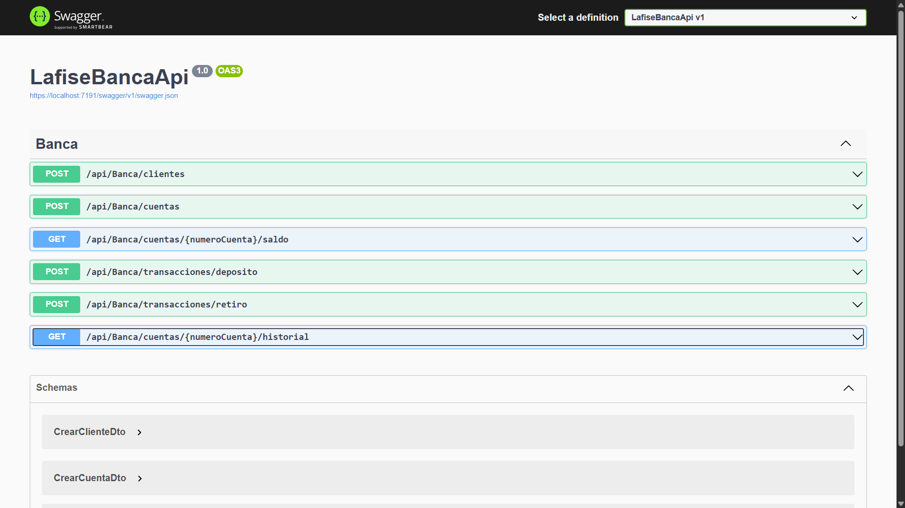

# 🏦 API de Gestión Bancaria (Prueba Técnica .NET)

API RESTful desarrollada con **.NET 8** para la gestión de clientes, cuentas bancarias y transacciones financieras. Este proyecto implementa una arquitectura limpia basada en capas, asegurando escalabilidad, mantenibilidad y el cumplimiento de principios SOLID.

---

## 📋 Características Principales
El sistema cumple con todos los requerimientos técnicos solicitados:

- **Gestión de Clientes:** Registro de perfiles con datos demográficos [cite: 18-23].
- **Gestión de Cuentas:** Creación de cuentas únicas asociadas a clientes con saldo inicial [cite: 24-25].
- **Transacciones Seguras:**
  - Depósitos y Retiros con validación de fondos en tiempo real (evita sobregiros) [cite: 28-32].
  - Registro histórico detallado calculando el *saldo después de cada transacción* [cite: 33-36].
- **Cálculo de Intereses:** Funcionalidad para aplicar intereses mensuales a las cuentas.
- **Consultas:** Verificación de saldo actual e historial de movimientos.

---

## 🛠️ Tecnologías Utilizadas

- **Core:** .NET 8 SDK (LTS)[cite: 5].
- **Framework Web:** ASP.NET Core Web API[cite: 6].
- **Persistencia:** Entity Framework Core con **SQLite**[cite: 45].
- **Pruebas:** xUnit + Moq + EF Core InMemory[cite: 7, 39].
- **Documentación:** Swagger UI (Swashbuckle).

---

## 🏗️ Arquitectura y Patrones de Diseño

El proyecto sigue las mejores prácticas de diseño de software[cite: 8, 46, 51, 52]:

1.  **Inyección de Dependencias:** Se utiliza el contenedor nativo de .NET para inyectar `IBancaService` y `BancaContext` en los controladores, desacoplando la lógica de la presentación.
2.  **Capa de Servicios:** Toda la lógica de negocio (validaciones, cálculos) reside en `BancaService`, manteniendo los controladores ligeros ("Skinny Controllers").
3.  **DTOs (Data Transfer Objects):** Se utilizan objetos específicos (`CrearClienteDto`, `DepositoRetiroDto`) para proteger la integridad de las entidades de dominio.
4.  **Principios SOLID:**
    - **S:** Cada clase tiene una responsabilidad única.
    - **O:** El diseño permite extender funcionalidades sin modificar el código base existente.
    - **D:** Los controladores dependen de abstracciones (`IBancaService`), no de implementaciones concretas.

---

## 🚀 Instrucciones de Ejecución

### Prerrequisitos
- Tener instalado el **SDK de .NET 8.0**.
- Visual Studio 2022 o VS Code.

### Pasos para levantar el proyecto

1.  **Clonar el repositorio:**
    ```bash
    git clone [https://github.com/Abner1710/LafiseBancaApi.git](https://github.com/Abner1710/LafiseBancaApi.git)
    cd LafiseBancaApi
    ```

2.  **Restaurar dependencias y Base de Datos:**
    El proyecto utiliza SQLite. Al ejecutar las migraciones, se creará automáticamente el archivo `banca.db`.
    ```bash
    dotnet restore
    dotnet ef database update
    ```

3.  **Ejecutar la API:**
    ```bash
    dotnet run
    ```
    O desde Visual Studio presiona `F5`.

4.  **Explorar la API:**
    Navega a la documentación interactiva (Swagger) para probar los endpoints:
    - URL: `https://localhost:7191/swagger` (El puerto puede variar según tu configuración local).


*Vista de los endpoints disponibles en la documentación interactiva.*

---

## 🧪 Pruebas Unitarias

Se ha implementado una suite de pruebas con **xUnit** utilizando una base de datos en memoria (`InMemoryDatabase`) para validar la lógica sin afectar los datos reales [cite: 39-44].

Las pruebas cubren los siguientes escenarios críticos:
✅ Creación exitosa de cuentas.
✅ Depósitos correctos.
✅ Retiros con fondos suficientes.
✅ **Bloqueo de retiros sin fondos suficientes** (Excepción controlada).
✅ Aplicación de intereses (5%) a las cuentas.
✅ Consulta de saldo y ordenamiento del historial.


*Validación exitosa de los 7 escenarios de prueba críticos.*

**Para ejecutar las pruebas:**
```bash
dotnet test
```
o desde Visual Studio en Ve al menú superior Prueba -> Explorador de pruebas (Test Explorer).

Verás una ventana nueva (usualmente a la izquierda). Debería aparecer LafiseBancaApi.Tests en rojo o azul.

Dale al botón de Play (Ejecutar todas) en esa ventanita.

📌 Notas Adicionales sobre la Lógica

Cierre Mensual (Intereses): Para cumplir con el requisito de "Aplicación de intereses", se expuso el endpoint POST /api/Banca/cierre-mensual. Este simula el proceso batch de fin de mes, aplicando un 5% de interés a todas las cuentas activas.

Manejo de Errores: La API devuelve códigos HTTP estándar:

200 OK: Operación exitosa.

400 Bad Request: Errores de validación (ej. Fondos insuficientes).

404 Not Found: Recurso (Cuenta/Cliente) no encontrado.

500 Internal Server Error: Errores no controlados (se evita exponer detalles sensibles).
